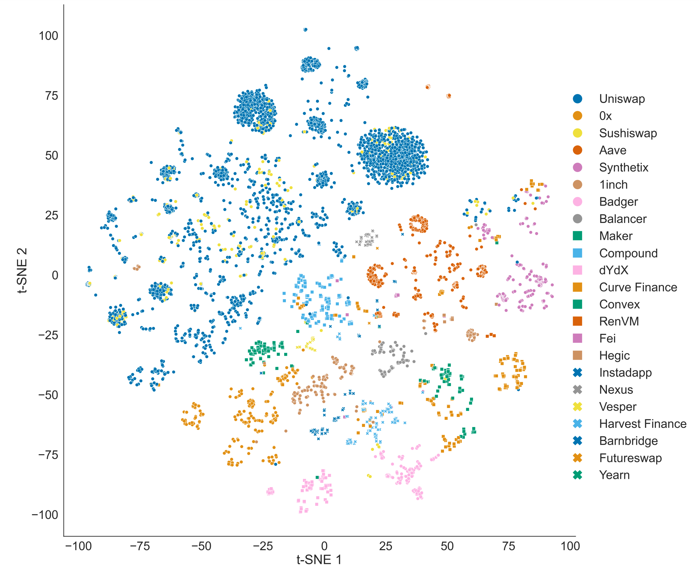

# DeFi-similarity
Graph representation learning-based code to cluster and categorize DeFi protocol building blocks.

Implementation of the paper *Investigating Similarities Across Decentralized Finance (DeFi) Services*, [[arxiv](https://arxiv.org/abs/2404.00034), [journal](https://www.ledgerjournal.org/ojs/ledger/article/view/402)].

# Env
Use the `pip install -r requirements.txt` command to install all of the Python modules and packages listed.

# Run

Run `python data_processor.py` to process the dataset.

> You may select different node features in util.py and regenerate the building block JSON files for graph representation learning. 

> (By default, JSON files with the Signatures Group node feature are provided).

Run `python main.py` to perferm the graph representation learning, clustering, evaluation, and visualization.



# Citation

```
@article{luo2025investigating,
  title={Investigating Similarities Across Decentralized Finance (DeFi) Services},
  author={Luo, Junliang and Kitzler, Stefan and Saggese, Pietro},
  journal={Ledger},
  volume={10},
  year={2025}
}
```

